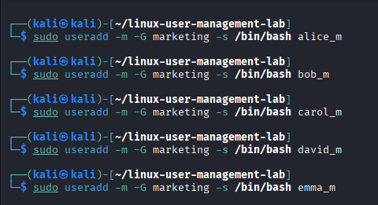

# :penguin Linux User Management Lab - TechCorp Solutions

## :pushpin User Management and File Permissions Lab

---

## :direct hit Objective
This lab demonstrates practical Linux system administration by creating users, managing groups and assigning file permisssions for two departments: Marketing and IT.
It ensures secure file access, privacy of individual users and collaborative group work using Linux permission structures.

---

## :hammer and wrench Tools Used

- Kali Linux
- Linux Terminal (Bash)
- GitHub
- Screenshot tool

---

# :desktop computer PART 1: Marketing Department (Private Files)

### Scenario
The Marketing department has five new employees. Each employee requires a personal workspace file that only they can access.

---

## Step 1: Create Marketing Group
```bash
sudo groupadd marketing
```


## Step 2: Create Marketing Users
```bash
sudo useradd -m -G marketing -s /bin/bash alice_m
sudo useradd -m -G marketing -s /bin/bash bob_m
sudo useradd -m -G marketing -s /bin/bash carol_m
sudo useradd -m -G marketing -s /bin/bash david_m
sudo useradd -m -G marketing -s /bin/bash emma_m
```


## Step 3: Create Marketing Shared Directory
```bash
sudo mkdir -p /home/shared/marketing
sudo chown root:marketing /home/shared/marketing
sudo chown 770 /home/shared/marketing
```


